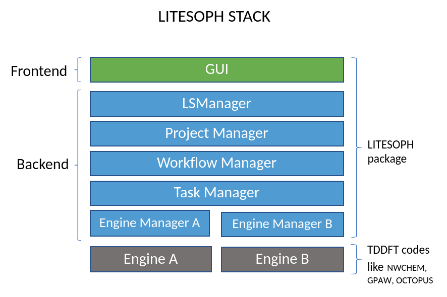

.. _code overview:

=================
Code Architecture
=================

This document describes the overall code architecture.

.. _litesoph stack:

Full Picture of the litesoph backend::

                       +---------+             
                       |LSManager|
                       +---------+
                     ______|_______
                    |              |
                    V              V
            ProjectInfo <---------ProjectManager
                |                   |
                V                   V
            WorkflowInfo <--------WorkflowManager
                |                   | 
                |                   V             
                |                  EngineManager
                |                     |  
                V                     V
            TaskInfo  <-------------Task
                                _______|______
                                |             |
                                V             V          
                            SubmitLocal   SubmitNetwork
                                                |
                                                V
                                        NetworkJobSubmission

.. autoclass:: litesoph.common.ls_manager.LSManager
   :members:
   :inherited-members:

.. autoclass:: litesoph.common.project_manager.ProjectManager
   :members:
   :inherited-members:

.. autoclass:: litesoph.common.workflow_manager.WorkflowManager
   :members:
   :inherited-members:

.. autoclass:: litesoph.common.engine_manager.EngineManager
   :members:
   :inherited-members:
   :noindex:

.. autoclass:: litesoph.common.Task
   :members:
   :noindex:
   :private-members:
   :member-order: bysource
   

.. autoclass:: litesoph.common.data_sturcture.data_classes.ProjectInfo
   :members:
   :inherited-members:

.. autoclass:: litesoph.common.data_sturcture.data_classes.WorkflowInfo
   :members:
   :inherited-members:

.. autoclass:: litesoph.common.data_sturcture.data_classes.TaskInfo
   :members:
   :inherited-members:

