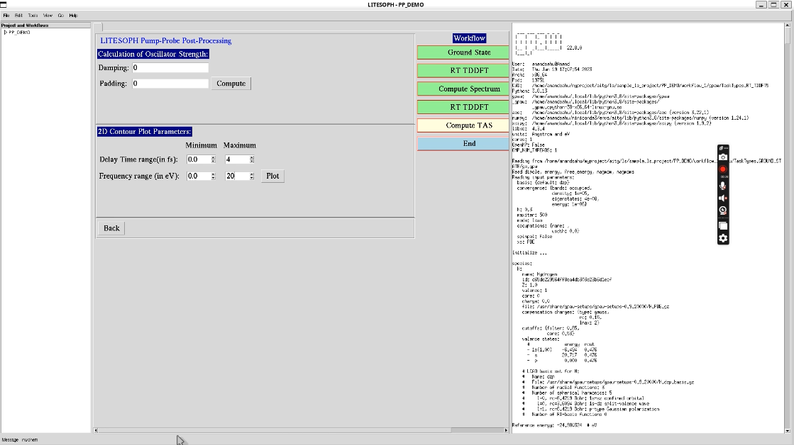
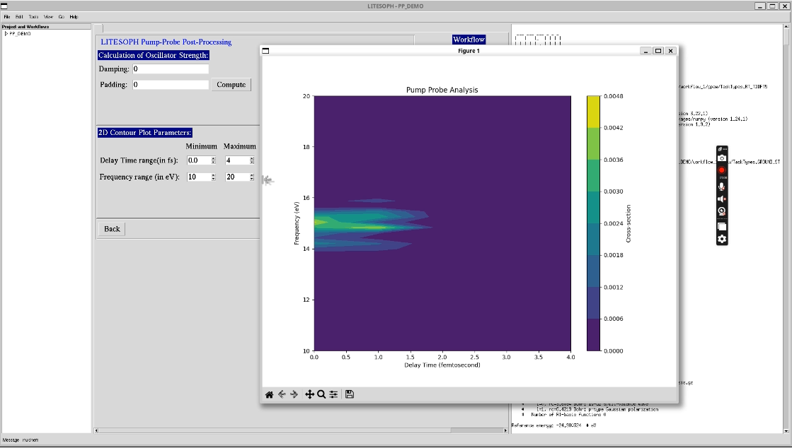

.. _compute-tas:

Compute TAS
===========

**LITESOPH Pump-Probe Post-Processing** computes oscillator strength and plots the Transient Absorption Spectrum (TAS). 

**1. Calculation of Oscillator Strength** includes parameters for the Fourier transform of dipole moment oscillations with time. These parameters are 
**Damping** and **Padding**.

**2. 2D Contour Plot Parameters:** This has two parameters as follows:

    **1. Delay Time range(in fs):** Time range which should be more than the maximum delay time among all Pump-Probe pairs.

    **2. Frequency range (in eV):** Energy window for which the 2D contour will be generated.

