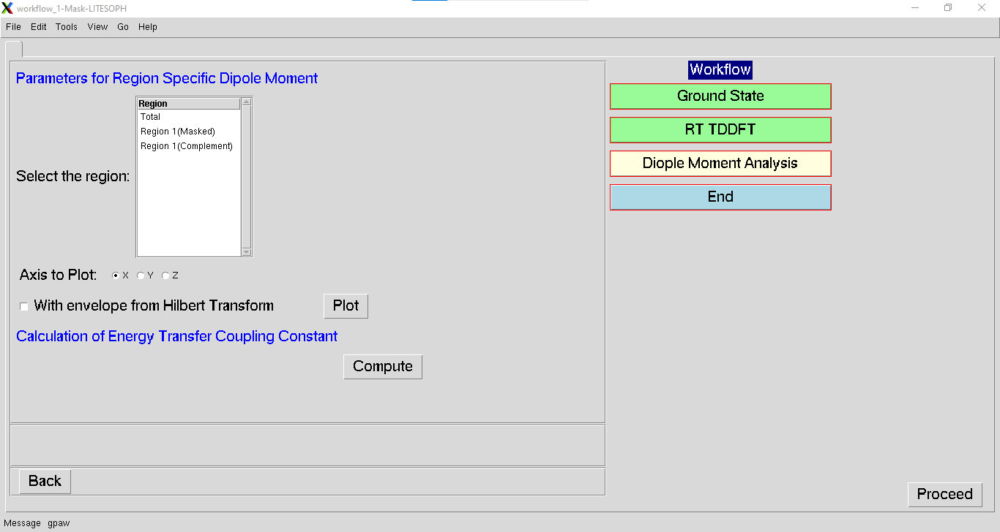
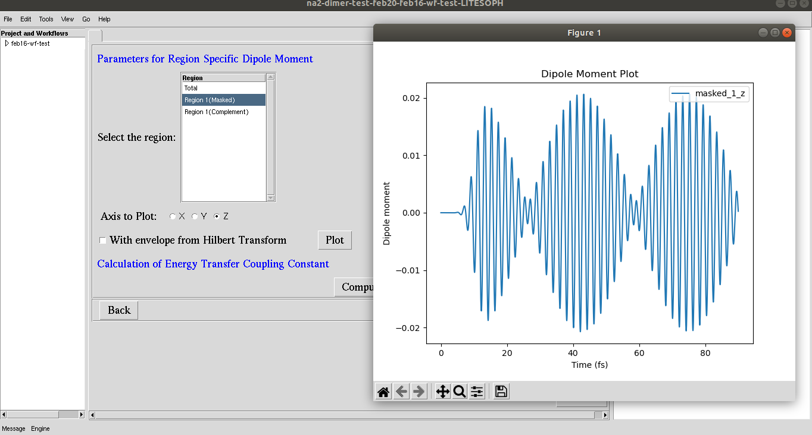

.. _dipole-moment:

Dipole moment analysis
======================

**1.** Input the **Parameters for Region Specific Dipole Moment**. Select the region for diplaying the time-varying dipole moment plot. 
Available options are **Total**, **Region 1(Masked)** and  **Region 1(Complement)**.

**2.** Select the cartesian component of the dipole moment to plot.

**3. With envelope from Hilbert Transform** plots the envelope for dipole oscillations.

**4. Calculation of Energy Transfer Coupling Constant** computes the coupling constant for the energy transfer.

.. .. image:: ./dipole_moment_plot.png
   :width: 800
   :alt: dipole_moment_plot

