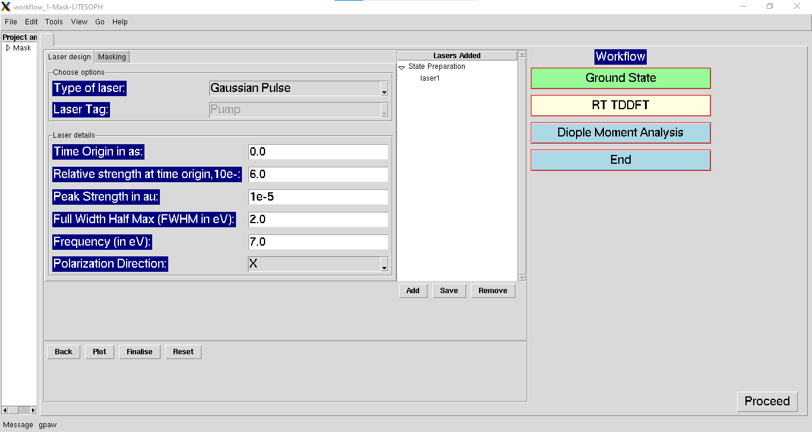
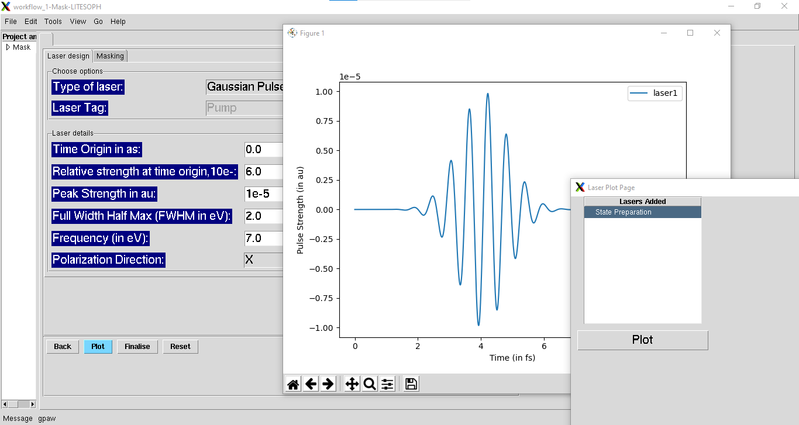
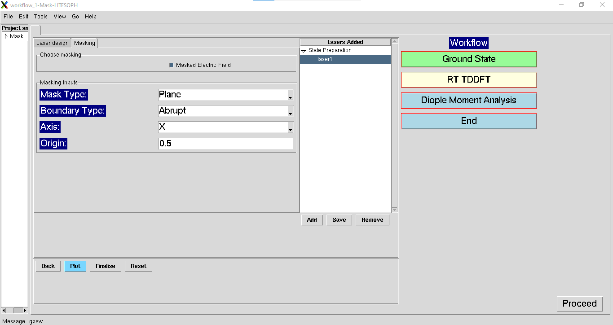

.. _rt-tddft:

RT-TDDFT
==========
The RT-TDDFT calculations can be performed starting with external perturbations, such as, Delta pulse and laser pulse. For the input parameters
of delta pulse, see :ref:`delta-kick`. For the input parameters of laser pulse, see :ref:`laser-design-tools`.

.. _delta-kick:

Delta kick Inputs
#################

.. image:: ./Delta-kick.png
   :width: 800
   :alt: delta_kick

**1. Laser Strength in a.u (E0):** Strength of the delta kick electric field to be applied. This excites all the electronic degrees of freedom at 
the beginning.

**2. Time steps (in attosecond):** Time steps for the dynamics of the Kohn-Sham equations.

**3. Number of Steps:** Total number of steps to be run for the dynamics. Total time is (Number of Steps*time steps)

**4. Frequency of data collection:** Number of times the data will be printed. Default alue `1` indicates that data will be collected at each time steps. 

**5. Polarisation Direction:** Polarization direction of the applied external electric field.

.. _laser-design-tools:

Laser Design tools
##################

.. _laser-design:

Laser design
------------

**1. Type of Laser:** *(default:Gaussian)* Available options are Gaussian pulse and Delta pulse. 

**2. Laser Tag:** *(default:Pump)* Applicable only in the case of Pump-Probe analysis. Choose either pump or probe for laser design.

For the parameters of Delta kick, refer to :ref:`delta-kick`. 

For the parameters of Gaussian pulse, see below.

   **1. Time Origin (as):** *(default:0)* Laser delay time from initialization of simulation in atto-seconds.

   **2. Relative strength at time origin, 10e-:** *(default:6)* Negative log of relative electric field strength at the starting time of the laser.

   **3. Peak Strength (au):** *(default:10e-5)* Intensity of laser in au.

   **4. Full Width Half Max (eV):** *(default:1)* FWHM of the Gaussian pulse.

   **5. Frequency (eV):** *(default:1)* Frequency of the Gaussian pulse.

   **6. Polarization Direction:** *(default:X)* Polarization Direction of the applied electric field.

**Add** and **Save** the lasers and view the laser using **Plot**.

**Finalise** the laser which will be used for further simulations.

.. _masking:

Masking
-------

Select the added lasers for which masking is to be applied. Under masking, check the **Masked Electric Field**. Use the following input parameters
for masking. This is optionally used to select a region to illuminate for the chosen laser.

**1. Mask Type:** *(default:Plane)* Types of mask defined as boundary to separate the masked and illuminated regions. Available options are :**Plane** and **Sphere**.
   
   * **Plane**: refers to the use of a dividing plane to define the mask
   
   * **Sphere**: refers to the use of a spherical region to illuminate

**2. Boundary Type:** *(default:Abrupt)* Smearing type at the mask boundary. Available options are **Abrupt** and **Smooth**.
   
   * **Abrupt**: refers to an abrupt division of cell i.e. using a Heaviside function

   * **Smooth**: refers to the boundary region being defined through an error function
**3. RSig**: *(default:0.1)* Applicable for Boundary Type: **Smooth**. Refers to sigma (in Angstroms) of the error function to be used

   
**Mask Specific Parameters**

**4. Axis:** *(default:X)*
Applicable for Mask Type: **Plane**. Direction along which the boundary is placed.

**5. Origin:** 
      * *(default:0.5)* Applicable for Mask Type: **Plane**. The location of the dividing plane (in cell parameter units). Only for coordinate < origin, the region is illuminated.
      * *(default:(0.5, 0.5, 0.5))* Applicable for Mask Type: **Sphere**. Coordinates (in cell parameter units) of the centre of the Sphere used

**6. Radius:** *(default:0.5)* Applicable for Mask Type: Sphere. Radius (in Angstroms) of the spherical region to be illuminated

.. **4. Origin:** Cut-off distance in fractional units beyond which the part of the system will be masked.

**Save** the masking details after including the above parameters.

.. _properties:

Properties
##########

.. image:: ./properties.png
   :width: 800
   :alt: Spectrum

**1. Observables to extract:** Choose the operation to be performed. 

For Spectrum Calculation choose **Absorption Spectrum**. 

For KSD calculation choose **Absorption Spectrum** and **Kohn Sham Decomposition**. 

For MO population calculation choose **Absorption Spectrum**, **Kohn Sham Decomposition** and **Population Correlation**.