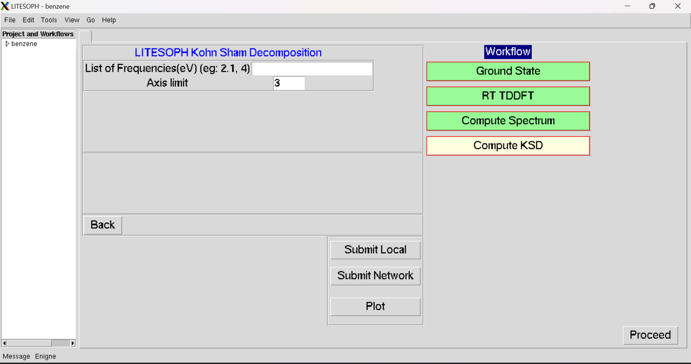

.. _KSD:

KSD
===

.. note::
   Compatible Engines: GPAW, Octopus

.. image:: ./KSD.png
   :width: 800
   :alt: Spectrum

The Workflow for the Kohn Sham Decomposition (KSD) is as follows:

**1.** Start the workflow with ground state calculation. See :ref:`GS`.

**2.** After the ground state calculation is done, proceed to RT-TDDFT calculation. See :ref:`rt-tddft`

**3.** After RT-TDDFT calculation is done, proceed to compute spectrum. See :ref:`compute-spectrum`.

**4.** After spectrum is computed, proceed to compute KSD. See :ref:`compute-ksd`

.. _compute-ksd:

Compute KSD
-----------

.. note::
   Compatible Engines: GPAW, Octopus

To perform Kohn Sham Decomposition (KSD), the following parameters are used:   

**1. List of frequencies (eV):** Input excitation energies (eV) to be targeted. For each frequency 
the KSD is performed and plotted seperately.

**2. Axis limit:** Higher limit of both X-axis (occupied energy) and 
Y-axis (unoccupied energy) for plotting. The origin is set as (0,0).