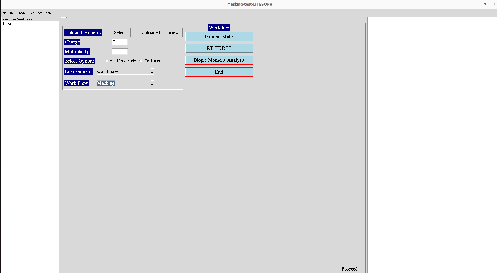

.. _laser-masking:

Masking
=======

The Workflow for the Laser-masking is as follows:

**1.** Start the workflow with ground state calculation. See :ref:`GS`

**2.** After the ground state calculation is done, proceed to RT-TDDFT calculation. See :ref:`rt-tddft`, 
followed by Laser design. See :ref:`laser-design`

**3.** After RT-TDDFT calculation is done, proceed to compute spectrum. See :ref:`compute-spectrum`

**4.** Masking procedure

**5.** For post processing and and visualization, see :ref:`dipole-moment`