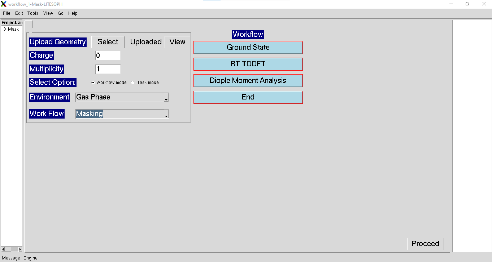
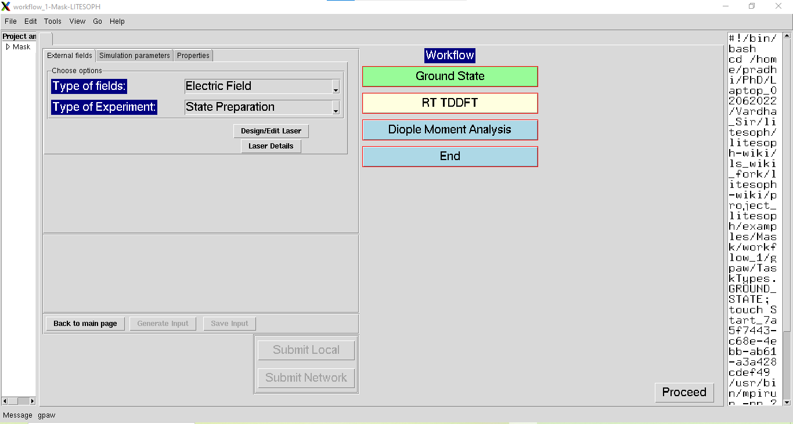

.. _laser-masking:

Laser-Masking
=============

.. note::
   Compatible Engines: GPAW

The Workflow for the Laser-masking is described below. As, masking feature is only available in GPAW, the **GS** parameters should be chosen 
accordingly. For example, PBE as Exchange Correaltion and lcao as Basis Type.  

**1.** Start the workflow with ground state calculation. See :ref:`GS`

**2.** After the ground state calculation is done, proceed to RT-TDDFT calculation with laser pulse.

**External fields:** For masking calculations, choose the parameters for **External fields** as Electric Field (**Type of fields**) and 
State Preparation (**Type of Experiment**). After that, proceed to **Design/Edit Laser**. For laser design, see :ref:`laser-design`.

**3.** To choose the masking parameters, see :ref:`masking`.

**Note:** To target a particular frequency, absorption spectrum should be known. To compute spectrum, see :ref:`compute-spectrum`.

**4.** Run the RT-TDDFT simulation.

**5.** For post processing and visualization of time variation of dipole moment, see :ref:`dipole-moment`.