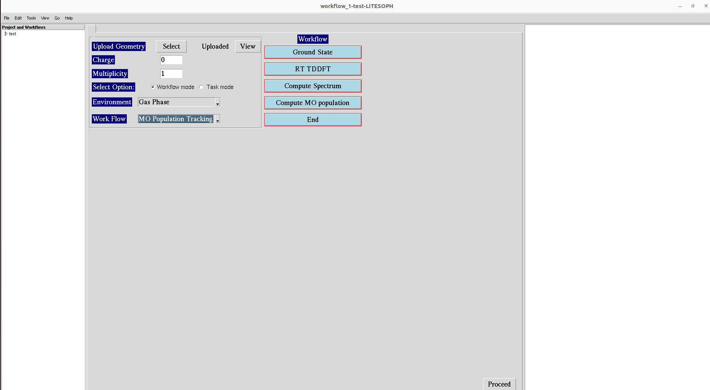

.. _MO:

=================================
Molecular Orbital (MO) Population
=================================

.. note::
   Compatible Engines: GPAW, NWChem, Octopus

The Workflow for the calculations of MO population is as follows:

**1.**  Start the workflow with ground state calculation. See :ref:`GS`.

**2.** After the ground state calculation is done, proceed to RT-TDDFT calculation. See :ref:`rt-tddft`.

**3.** After RT-TDDFT calculation is done, proceed to compute spectrum. See :ref:`compute-spectrum`.

**4.** After spectrum is computed, proceed to compute MO population. See :ref:`compute-mo`.

.. **5.** After the MO population is computed, for post processing and visualization, see :ref:`pp-visualization`.