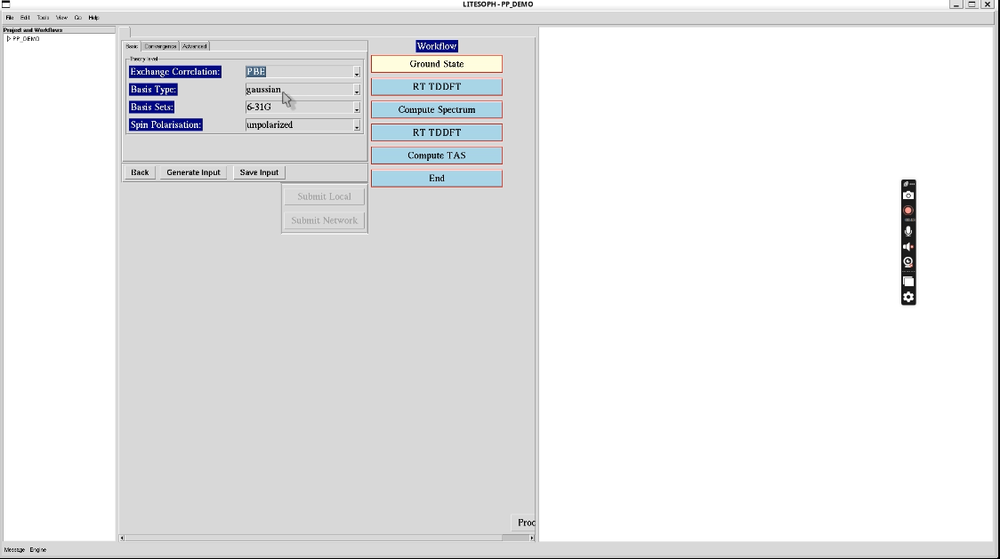
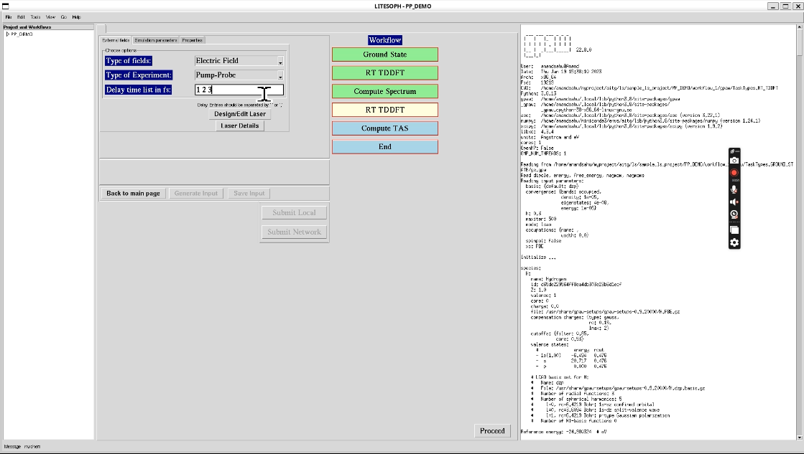

.. _pump_probe:

Pump-probe
==========

.. note::
   Compatible Engines: GPAW, NWChem, Octopus

The Workflow for the Pump-Probe is as follows:

**1.** Start the workflow with ground state calculation. See :ref:`GS`

**2.** After the ground state calculation is done, proceed to RT-TDDFT calculation for spectrum calculation. See :ref:`delta-kick`.

**3.** After RT-TDDFT calculation is done, proceed to compute spectrum. See :ref:`compute-spectrum`

**External fields:** For Pump-Probe calculations, choose the parameters for **External fields** as Electric Field (**Type of fields**) and 
Pump-Probe (**Type of Experiment**). For each Pump-Probe input **Delay time list in fs** separated by space. After that, proceed to 
**Design/Edit Laser**. For laser design, see :ref:`laser-design`.

**4.** Run all the RT-TDDFT simulations. The first simulation uses only pump. After that, perform each simulation for each pump-probe pair,
consecutively.

**5.** For post processing and and visualization of TAS, see :ref:`compute-tas`.