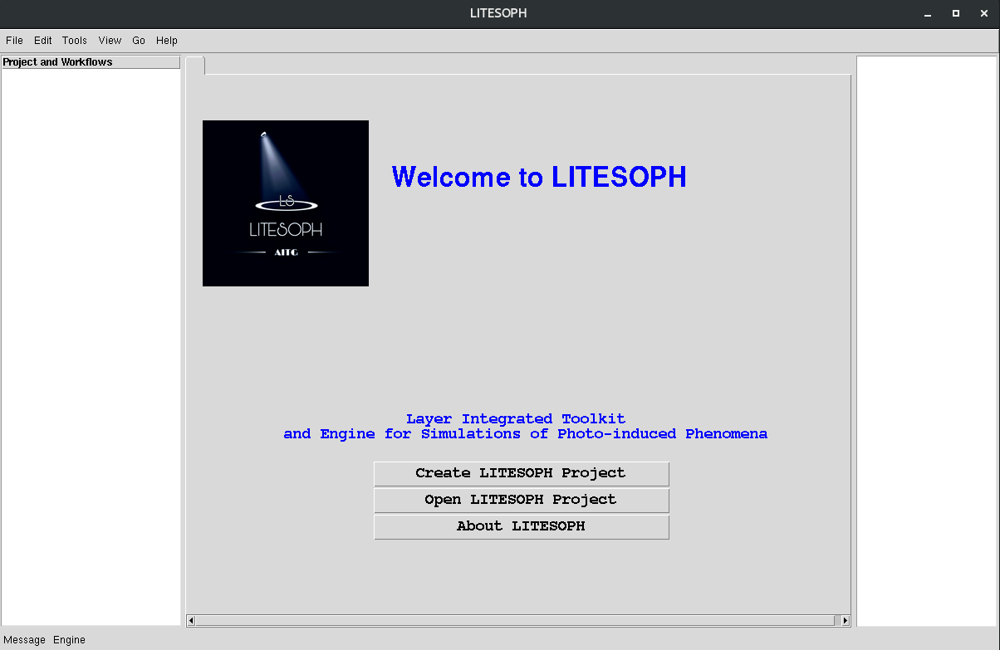
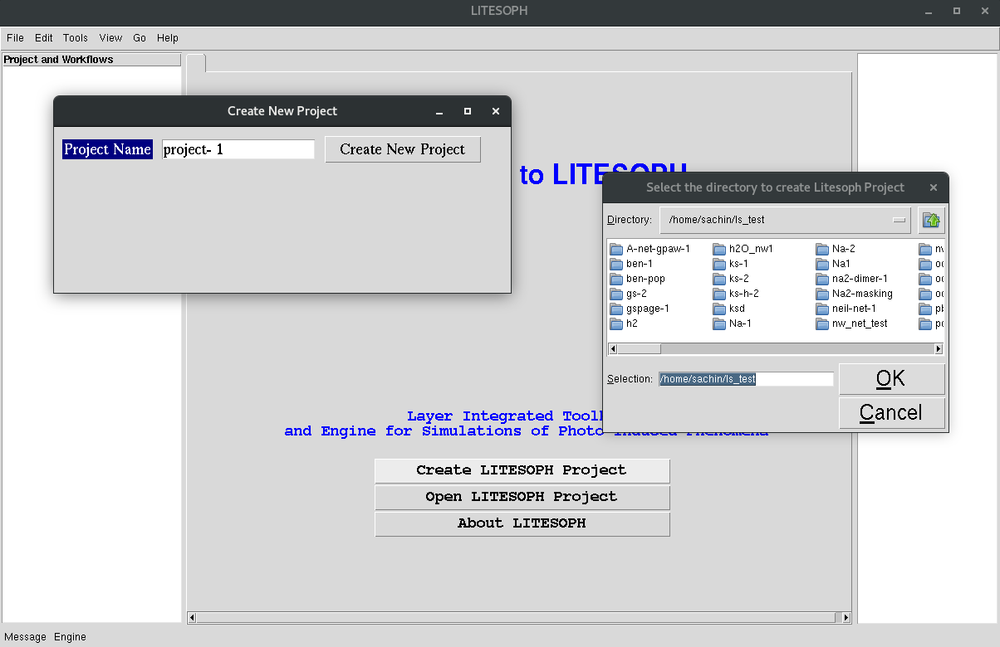
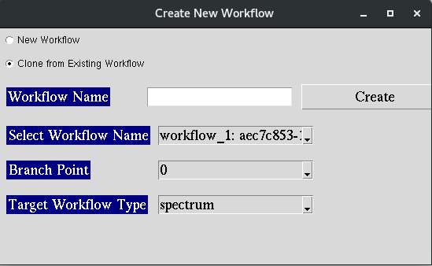

Starting LITESOPH
==================

**1.** Create LITESOPH Project: Creates new LITESOPH project folder

**2.** Open LITESOPH Project: Opens an existing LITESOPH project folder

**3.** About LITESOPH: Links to the official website page

Create a new Project 
=============================
.. image when Create LITESOPH Project is clicked

**1.** Create LITESOPH Project: 
    * Enter the project name and select the directory.

.. Open an existing Project 
.. =============================
.. image when Create LITESOPH Project is clicked

.. **2.** Open LITESOPH Project: 
    * Select the LITESOPH project folder to open.

.. _create_workflow:

Create a Workflow
===============================
.. image Workflow manager page

Available two options are:
    * New Workflow
    * Clone from an existing Workflow

New Workflow
-------------

.. image:: ./create_new_workflow.png
   :width: 800
   :alt: create_new_workflow_page

Creates a new workflow from scratch.

Clone from an existing Workflow
--------------------------------

1.Creates a new workflow from existing workflows.
2.Select the workflow from available options.
3.Select the branch point: the tasks upto this point are copied from the existing workflows.
4.Select the workflow type to proceed with.

LITESOPH calculation is initiated with creating a workflow under current project. This is a chain of tasks defined by 
    1. Workflow Mode 
    2. Task Mode

**1. Menubar:** 

    File: Options:
        * New Workflow : Click to create a new Workflow under current LITESOPH project :ref:`create_workflow`            
        * New Project
        * Open Project
        * Exit

**2. Left Panel:** Shows the tree view of existing workflows under current LITESOPH project

**3. Central Panel:** Collects general information/options
    * Geometry 
    * Upload Geometry: Uploads the geometry file in .xyz format
    * View: Visualizes the geometry file using visualization software such as VMD, VESTA
    * System Info
    * Charge
    * Multiplicity
    * Select Options
        * Workflow Mode: Navigates the users through predefined steps for selected workflow (Link to workflow mode description)
        * Task Mode: Task-wise implementation defined under categories: Pre-processing, Simulation, Post-Processing

**4. Right Panel:** Shows the generated input and update to users, relavant to the current view in text format.
